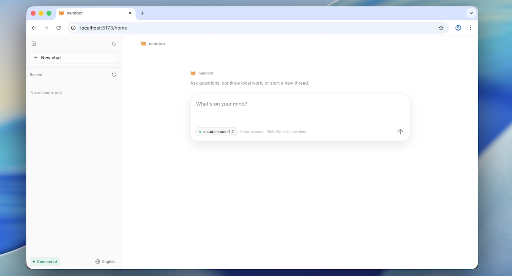

<div align="center">
  <p>
    <a href="https://pypi.org/project/nanobot-ai/"></a>
    <a href="https://pepy.tech/project/nanobot-ai"></a>
    
    
    <a href="https://github.com/HKUDS/nanobot/graphs/commit-activity" target="_blank">
        </a>
    <a href="https://github.com/HKUDS/nanobot/issues?q=is%3Aissue%20is%3Aclosed" target="_blank">
        </a>
    <a href="https://twitter.com/intent/follow?screen_name=nanobot_project" target="_blank">
        </a>
    <a href="https://nanobot.wiki/docs/latest/getting-started/nanobot-overview"></a>
    <a href="./COMMUNICATION.md"></a>
    <a href="./COMMUNICATION.md"></a>
    <a href="https://discord.gg/MnCvHqpUGB"></a>
  </p>
</div>

🐈 **nanobot** is an open-source and ultra-lightweight AI agent in the spirit of [OpenClaw](https://github.com/openclaw/openclaw), [Claude Code](https://www.anthropic.com/claude-code), and [Codex](https://www.openai.com/codex/). It keeps the core agent loop small and readable while still supporting chat channels, memory, MCP and practical deployment paths, so you can go from local setup to a long-running personal agent with minimal overhead.

## 📢 News

- **2026-05-15** 🚀 Released **v0.2.0** — **`/goal`** holds sustained objectives across turns, WebUI now ships inside the wheel, image generation end to end, 5 new providers with `fallback_models`, and a real agent-loop refactor. Please see [release notes](https://github.com/HKUDS/nanobot/releases/tag/v0.2.0) for details.
- **2026-05-14** 🎯 **`/goal`** for long-term objectives, visible multi-step progress, long-horizon missions in chat.
- **2026-05-13** 🧠 Streaming reasoning before answers, automatic backup models, smoother plug-in reconnects.
- **2026-05-12** 🎛️ Saved model presets with WebUI badge, simpler plug-in tools, quieter Feishu topic threads.
- **2026-05-11** 🖥️ NVIDIA NIM support, terminal bot name and icon, streamed reasoning and MiMo toggle clarity.
- **2026-05-09** 🖼️ Sharper image replay, BYO web-search keys in Settings, Feishu threads routed cleanly.
- **2026-05-08** ✨ Inline chat image, redesigned Settings and keys, Dream memory aligned with visible history.
- **2026-05-07** 📜 Locale-aware slash palette in WebUI, LAN login, faithful HTTP streaming responses.
- **2026-05-06** 🧩 Tunable tool hint, steadier voice and plug-in startups, schedules and reminders that stick.
- **2026-05-05** 🛡️ Quiet deny for unknown Telegram chats, Dream cleanup, fuller automation summaries.

<details>
<summary>Earlier news</summary>

- **2026-05-04** 🔐 Safer DingTalk outbound media links, durable cron persistence, DeepSeek polish.
- **2026-05-03** ⚙️ Predictable shell allow-list behavior, isolated chats mid-reply, cleaner interactive retries.
- **2026-05-02** 🐈 LongCat support, smarter token sizing hints, clearer bundled upgrade guidance.
- **2026-05-01** ☁️ Native AWS Bedrock provider, tighter helper handoffs and scoped session files.
- **2026-04-30** 💬 Feishu threads that honor replies and topics, WhatsApp bridge refresh on source edits.
- **2026-04-29** 🚀 Released **v0.1.5.post3** — Smarter threads on Feishu, Discord, Slack, and Teams; **DeepSeek-V4**; Hugging Face & Olostep; choices, `/history`, and steadier long chats. Please see [release notes](https://github.com/HKUDS/nanobot/releases/tag/v0.1.5.post3) for details.
- **2026-04-28** 🌐 Olostep web search, Hugging Face provider, safer workspace-tool interruptions.
- **2026-04-27** 💬 `/history` command, smarter session replay caps, smoother Discord / Slack threads.
- **2026-04-26** 🧭 Natural cron reminders, thread-aware restarts, safer local provider and shell behavior.
- **2026-04-25** 🧩 `ask_user` choices, macOS LaunchAgent deployment, MSTeams stale-reference cleanup.
- **2026-04-24** 🎥 Video attachments for channels, DeepSeek thinking control, faster document startup.
- **2026-04-23** 🧵 Discord thread sessions, Telegram inline buttons, structured tool progress updates.
- **2026-04-22** 🔎 GitHub Copilot GPT-5 / o-series support, configurable web fetch, WebUI image uploads.
- **2026-04-21** 🚀 Released **v0.1.5.post2** — Windows & Python 3.14 support, Office document reading, SSE streaming for the OpenAI-compatible API, and stronger reliability across sessions, memory, and channels. Please see [release notes](https://github.com/HKUDS/nanobot/releases/tag/v0.1.5.post2) for details.
- **2026-04-20** 🎨 Kimi K2.6 support, Telegram long-message split, WebUI typography & dark-mode polish.
- **2026-04-19** 🌐 WebUI i18n locale switcher, atomic session writes with auto-repair.
- **2026-04-18** 🧪 Initial WebUI chat, smarter setup wizard menus, WebSocket multi-chat multiplexing.
- **2026-04-17** 🪟 Windows & Python 3.14 CI, Dream line-age memory, email self-loop guard.
- **2026-04-16** 📡 SSE streaming for OpenAI-compatible API, Discord channel allow-list.
- **2026-04-15** 🎛️ LM Studio & nullable API keys, MiniMax thinking endpoint, runtime SelfTool.
- **2026-04-14** 🚀 Released **v0.1.5.post1** — Dream skill discovery, mid-turn follow-up injection, WebSocket channel, and deeper channel integrations. Please see [release notes](https://github.com/HKUDS/nanobot/releases/tag/v0.1.5.post1) for details.
- **2026-04-13** 🛡️ Agent turn hardened — user messages persisted early, auto-compact skips active tasks.
- **2026-04-12** 🔒 Lark global domain support, Dream learns discovered skills, shell sandbox tightened.
- **2026-04-11** ⚡ Context compact shrinks sessions on the fly; Kagi web search; QQ & WeCom full media.
- **2026-04-10** 📓 Notebook editing tool, multiple MCP servers, Feishu streaming & done-emoji.
- **2026-04-09** 🔌 WebSocket channel, unified cross-channel session, `disabled_skills` config.
- **2026-04-08** 📤 API file uploads, OpenAI reasoning auto-routing with Responses fallback.
- **2026-04-07** 🧠 Anthropic adaptive thinking, MCP resources & prompts exposed as tools.
- **2026-04-06** 🛰️ Langfuse observability, unified Whisper transcription, email attachments.
- **2026-04-05** 🚀 Released **v0.1.5** — sturdier long-running tasks, Dream two-stage memory, production-ready sandboxing and programming Agent SDK. Please see [release notes](https://github.com/HKUDS/nanobot/releases/tag/v0.1.5) for details.
- **2026-04-04** 🚀 Jinja2 response templates, Dream memory hardened, smarter retry handling.
- **2026-04-03** 🧠 Xiaomi MiMo provider, chain-of-thought reasoning visible, Telegram UX polish.
- **2026-04-02** 🧱 Long-running tasks run more reliably — core runtime hardening.
- **2026-04-01** 🔑 GitHub Copilot auth restored; stricter workspace paths; OpenRouter Claude caching fix.
- **2026-03-31** 🛰️ WeChat multimodal alignment, Discord/Matrix polish, Python SDK facade, MCP and tool fixes.
- **2026-03-30** 🧩 OpenAI-compatible API tightened; composable agent lifecycle hooks.
- **2026-03-29** 💬 WeChat voice, typing, QR/media resilience; fixed-session OpenAI-compatible API.
- **2026-03-28** 📚 Provider docs refresh; skill template wording fix.
- **2026-03-27** 🚀 Released **v0.1.4.post6** — architecture decoupling, litellm removal, end-to-end streaming, WeChat channel, and a security fix. Please see [release notes](https://github.com/HKUDS/nanobot/releases/tag/v0.1.4.post6) for details.
- **2026-03-26** 🏗️ Agent runner extracted and lifecycle hooks unified; stream delta coalescing at boundaries.
- **2026-03-25** 🌏 StepFun provider, configurable timezone, Gemini thought signatures.
- **2026-03-24** 🔧 WeChat compatibility, Feishu CardKit streaming, test suite restructured.
- **2026-03-23** 🔧 Command routing refactored for plugins, WhatsApp/WeChat media, unified channel login CLI.
- **2026-03-22** ⚡ End-to-end streaming, WeChat channel, Anthropic cache optimization, `/status` command.
- **2026-03-21** 🔒 Replace `litellm` with native `openai` + `anthropic` SDKs. Please see [commit](https://github.com/HKUDS/nanobot/commit/3dfdab7).
- **2026-03-20** 🧙 Interactive setup wizard — pick your provider, model autocomplete, and you're good to go.
- **2026-03-19** 💬 Telegram gets more resilient under load; Feishu now renders code blocks properly.
- **2026-03-18** 📷 Telegram can now send media via URL. Cron schedules show human-readable details.
- **2026-03-17** ✨ Feishu formatting glow-up, Slack reacts when done, custom endpoints support extra headers, and image handling is more reliable.
- **2026-03-16** 🚀 Released **v0.1.4.post5** — a refinement-focused release with stronger reliability and channel support, and a more dependable day-to-day experience. Please see [release notes](https://github.com/HKUDS/nanobot/releases/tag/v0.1.4.post5) for details.
- **2026-03-15** 🧩 DingTalk rich media, smarter built-in skills, and cleaner model compatibility.
- **2026-03-14** 💬 Channel plugins, Feishu replies, and steadier MCP, QQ, and media handling.
- **2026-03-13** 🌐 Multi-provider web search, LangSmith, and broader reliability improvements.
- **2026-03-12** 🚀 VolcEngine support, Telegram reply context, `/restart`, and sturdier memory.
- **2026-03-11** 🔌 WeCom, Ollama, cleaner discovery, and safer tool behavior.
- **2026-03-10** 🧠 Token-based memory, shared retries, and cleaner gateway and Telegram behavior.
- **2026-03-09** 💬 Slack thread polish and better Feishu audio compatibility.
- **2026-03-08** 🚀 Released **v0.1.4.post4** — a reliability-packed release with safer defaults, better multi-instance support, sturdier MCP, and major channel and provider improvements. Please see [release notes](https://github.com/HKUDS/nanobot/releases/tag/v0.1.4.post4) for details.
- **2026-03-07** 🚀 Azure OpenAI provider, WhatsApp media, QQ group chats, and more Telegram/Feishu polish.
- **2026-03-06** 🪄 Lighter providers, smarter media handling, and sturdier memory and CLI compatibility.
- **2026-03-05** ⚡️ Telegram draft streaming, MCP SSE support, and broader channel reliability fixes.
- **2026-03-04** 🛠️ Dependency cleanup, safer file reads, and another round of test and Cron fixes.
- **2026-03-03** 🧠 Cleaner user-message merging, safer multimodal saves, and stronger Cron guards.
- **2026-03-02** 🛡️ Safer default access control, sturdier Cron reloads, and cleaner Matrix media handling.
- **2026-03-01** 🌐 Web proxy support, smarter Cron reminders, and Feishu rich-text parsing improvements.
- **2026-02-28** 🚀 Released **v0.1.4.post3** — cleaner context, hardened session history, and smarter agent. Please see [release notes](https://github.com/HKUDS/nanobot/releases/tag/v0.1.4.post3) for details.
- **2026-02-27** 🧠 Experimental thinking mode support, DingTalk media messages, Feishu and QQ channel fixes.
- **2026-02-26** 🛡️ Session poisoning fix, WhatsApp dedup, Windows path guard, Mistral compatibility.
- **2026-02-25** 🧹 New Matrix channel, cleaner session context, auto workspace template sync.
- **2026-02-24** 🚀 Released **v0.1.4.post2** — a reliability-focused release with a redesigned heartbeat, prompt cache optimization, and hardened provider & channel stability. See [release notes](https://github.com/HKUDS/nanobot/releases/tag/v0.1.4.post2) for details.
- **2026-02-23** 🔧 Virtual tool-call heartbeat, prompt cache optimization, Slack mrkdwn fixes.
- **2026-02-22** 🛡️ Slack thread isolation, Discord typing fix, agent reliability improvements.
- **2026-02-21** 🎉 Released **v0.1.4.post1** — new providers, media support across channels, and major stability improvements. See [release notes](https://github.com/HKUDS/nanobot/releases/tag/v0.1.4.post1) for details.
- **2026-02-20** 🐦 Feishu now receives multimodal files from users. More reliable memory under the hood.
- **2026-02-19** ✨ Slack now sends files, Discord splits long messages, and subagents work in CLI mode.
- **2026-02-18** ⚡️ nanobot now supports VolcEngine, MCP custom auth headers, and Anthropic prompt caching.
- **2026-02-17** 🎉 Released **v0.1.4** — MCP support, progress streaming, new providers, and multiple channel improvements. Please see [release notes](https://github.com/HKUDS/nanobot/releases/tag/v0.1.4) for details.
- **2026-02-16** 🦞 nanobot now integrates a [ClawHub](https://clawhub.ai) skill — search and install public agent skills.
- **2026-02-15** 🔑 nanobot now supports OpenAI Codex provider with OAuth login support.
- **2026-02-14** 🔌 nanobot now supports MCP! See [MCP section](#mcp-model-context-protocol) for details.
- **2026-02-13** 🎉 Released **v0.1.3.post7** — includes security hardening and multiple improvements. **Please upgrade to the latest version to address security issues**. See [release notes](https://github.com/HKUDS/nanobot/releases/tag/v0.1.3.post7) for more details.
- **2026-02-12** 🧠 Redesigned memory system — Less code, more reliable. Join the [discussion](https://github.com/HKUDS/nanobot/discussions/566) about it!
- **2026-02-11** ✨ Enhanced CLI experience and added MiniMax support!
- **2026-02-10** 🎉 Released **v0.1.3.post6** with improvements! Check the updates [notes](https://github.com/HKUDS/nanobot/releases/tag/v0.1.3.post6) and our [roadmap](https://github.com/HKUDS/nanobot/discussions/431).
- **2026-02-09** 💬 Added Slack, Email, and QQ support — nanobot now supports multiple chat platforms!
- **2026-02-08** 🔧 Refactored Providers—adding a new LLM provider now takes just 2 simple steps! Check [here](#providers).
- **2026-02-07** 🚀 Released **v0.1.3.post5** with Qwen support & several key improvements! Check [here](https://github.com/HKUDS/nanobot/releases/tag/v0.1.3.post5) for details.
- **2026-02-06** ✨ Added Moonshot/Kimi provider, Discord integration, and enhanced security hardening!
- **2026-02-05** ✨ Added Feishu channel, DeepSeek provider, and enhanced scheduled tasks support!
- **2026-02-04** 🚀 Released **v0.1.3.post4** with multi-provider & Docker support! Check [here](https://github.com/HKUDS/nanobot/releases/tag/v0.1.3.post4) for details.
- **2026-02-03** ⚡ Integrated vLLM for local LLM support and improved natural language task scheduling!
- **2026-02-02** 🎉 nanobot officially launched! Welcome to try 🐈 nanobot!

</details>


## 💡 Key Features of nanobot

- **Ultra-lightweight**: stable long-running agent behavior with a small, readable core.
- **Research-ready**: the codebase is intentionally simple enough to study, modify, and extend.
- **Practical**: chat channels, API, memory, MCP, and deployment paths are already built in.
- **Hackable**: you can start fast, then go deeper through repo docs instead of a monolithic landing page.

## 📦 Install

> [!IMPORTANT]
> If you want the newest features and experiments, install from source. 
> 
> If you want the most stable day-to-day experience, install from PyPI or with `uv`.

**Install from source**

```bash
git clone https://github.com/HKUDS/nanobot.git
cd nanobot
pip install -e .
```

**Install with `uv`**

```bash
uv tool install nanobot-ai
```

**Install from PyPI**

```bash
pip install nanobot-ai
```

## 🚀 Quick Start

**1. Initialize**

```bash
nanobot onboard
```

**2. Configure** (`~/.nanobot/config.json`)

Configure these **two parts** in your config (other options have defaults). Add or merge the following blocks into your existing config instead of replacing the whole file.

*Set your API key* (e.g. [OpenRouter](https://openrouter.ai/keys), recommended for global users):

```json
{
  "providers": {
    "openrouter": {
      "apiKey": "sk-or-v1-xxx"
    }
  }
}
```

*Set your model* (optionally pin a provider — defaults to auto-detection):

```json
{
  "agents": {
    "defaults": {
      "provider": "openrouter",
      "model": "anthropic/claude-opus-4-6"
    }
  }
}
```

**3. Chat**

```bash
nanobot agent
```


- Want different LLM providers, web search, MCP, security settings, or more config options? See [Configuration](./docs/configuration.md)
- Want to run locally? Use [Atomic Chat](./docs/configuration.md#atomic-chat-local), [vLLM](./docs/configuration.md#vllm-local-openai-compatible), [Ollama](./docs/configuration.md#ollama-local), and [others](./docs/configuration.md#local-providers).
- Want to run nanobot in chat apps like Telegram, Discord, WeChat or Feishu? See [Chat Apps](./docs/chat-apps.md)
- Want Docker or Linux service deployment? See [Deployment](./docs/deployment.md)

## 🌐 WebUI

The WebUI ships **inside the published wheel** — no extra build step. Just enable the WebSocket channel and open it in your browser.

<p align="center">
  
</p>

**1. Enable the WebSocket channel in `~/.nanobot/config.json`**

```json
{ "channels": { "websocket": { "enabled": true } } }
```

**2. Start the gateway**

```bash
nanobot gateway
```

**3. Open the WebUI**

Visit [`http://127.0.0.1:8765`](http://127.0.0.1:8765) in your browser. To open it from another device on your LAN, see [WebUI docs → LAN access](./webui/README.md#access-from-another-device-lan).

> [!TIP]
> Working on the WebUI itself? Check out [`webui/README.md`](./webui/README.md) for the Vite dev server (HMR) workflow.

## 🏗️ Architecture

<p align="center">
  
</p>

🐈 nanobot stays lightweight by centering everything around a small agent loop: messages come in from chat apps, the LLM decides when tools are needed, and memory or skills are pulled in only as context instead of becoming a heavy orchestration layer. That keeps the core path readable and easy to extend, while still letting you add channels, tools, memory, and deployment options without turning the system into a monolith.

## ✨ Features

<table align="center">
  <tr align="center">
    <th><p align="center">📈 24/7 Real-Time Market Analysis</p></th>
    <th><p align="center">🚀 Full-Stack Software Engineer</p></th>
    <th><p align="center">📅 Smart Daily Routine Manager</p></th>
    <th><p align="center">📚 Personal Knowledge Assistant</p></th>
  </tr>
  <tr>
    <td align="center"><p align="center"></p></td>
    <td align="center"><p align="center"></p></td>
    <td align="center"><p align="center"></p></td>
    <td align="center"><p align="center"></p></td>
  </tr>
  <tr>
    <td align="center">Discovery • Insights • Trends</td>
    <td align="center">Develop • Deploy • Scale</td>
    <td align="center">Schedule • Automate • Organize</td>
    <td align="center">Learn • Memory • Reasoning</td>
  </tr>
</table>

## 📚 Docs

Browse the [repo docs](./docs/README.md) for the latest features and GitHub development version, or visit [nanobot.wiki](https://nanobot.wiki/docs/latest/getting-started/nanobot-overview) for the stable release documentation.

- Talk to your nanobot with familiar chat apps: [Chat Apps](./docs/chat-apps.md)
- Configure providers, web search, MCP, and runtime behavior: [Configuration](./docs/configuration.md)
- Integrate nanobot with local tools and automations: [OpenAI-Compatible API](./docs/openai-api.md) · [Python SDK](./docs/python-sdk.md)
- Run nanobot with Docker or as a Linux service: [Deployment](./docs/deployment.md)

## 🤝 Contribute & Roadmap

PRs welcome! The codebase is intentionally small and readable. 🤗

### Branching Strategy

| Branch | Purpose |
|--------|---------|
| `main` | Stable releases — bug fixes and minor improvements |
| `nightly` | Experimental features — new features and breaking changes |

**Unsure which branch to target?** See [CONTRIBUTING.md](./CONTRIBUTING.md) for details.

**Roadmap** — Pick an item and [open a PR](https://github.com/HKUDS/nanobot/pulls)!

- **Multi-modal** — See and hear (images, voice, video)
- **Long-term memory** — Never forget important context
- **Better reasoning** — Multi-step planning and reflection
- **More integrations** — Calendar and more
- **Self-improvement** — Learn from feedback and mistakes

## Contact

This project was started by [Xubin Ren](https://github.com/re-bin) as a personal open-source project and continues to be maintained in an individual capacity using personal resources, with contributions from the open-source community. Feel free to contact [xubinrencs@gmail.com](mailto:xubinrencs@gmail.com) for questions, ideas, or collaboration.

### Contributors

<a href="https://github.com/HKUDS/nanobot/graphs/contributors">
  
</a>


## ⭐ Star History

<div align="center">
  <a href="https://star-history.com/#HKUDS/nanobot&Date">
    <picture>
      <source media="(prefers-color-scheme: dark)" srcset="https://api.star-history.com/svg?repos=HKUDS/nanobot&type=Date&theme=dark" />
      <source media="(prefers-color-scheme: light)" srcset="https://api.star-history.com/svg?repos=HKUDS/nanobot&type=Date" />
      
    </picture>
  </a>
</div>

<p align="center">
  <em> Thanks for visiting ✨ nanobot!</em><br><br>
  
</p>
